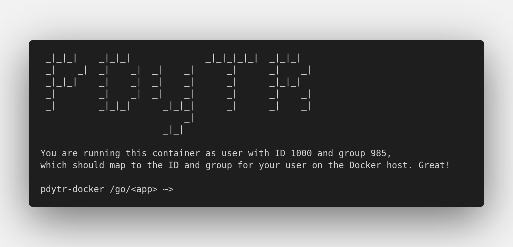

# gRPC-research-pdytr

[](https://github.com/ulises-jeremias/gRPC-research-pdytr/actions/workflows/ci.yml)

- [gRPC-research-pdytr](#grpc-research-pdytr)
  - [gRPC](#grpc)
    - [Quickstart](#quickstart)
    - [Simple example](#simple-example)
  - [RPC](#rpc)
    - [Quickstart](#quickstart-1)
    - [Simple example](#simple-example-1)
  - [Tests](#tests)

## gRPC

### Quickstart

We provide a docker environment to execute the different applications. To start the docker container execute the following command,

```sh
$ ./bin/grpc --app=<app> [--build] [--root]
```

where,

```
app = simp | ftp | user_lookup | ...
```

_NOTE: Execute `./bin/grpc -h` to know more about flags._

This will execute a docker container in interactive mode with a volume in the directory of the application.

<p align="center">
  
</p>

Once the docker container is running you will be able to run the following examples!

### Simple example

```sh
# generate proto file
~> protoc --go_out=plugins=grpc:. ./<app>.proto

# execute server in background
~> go run ./server/main.go &

# execute client
~> go run ./client/main.go
```

## RPC

### Quickstart

We provide a docker environment to execute the different applications. To start the docker container execute the following command,

```sh
$ ./bin/rpc --app=<app> [--build] [--root]
```

where,

```
app = simp | ftp | user_lookup | ...
```

_NOTE: Execute `./bin/rpc -h` to know more about flags._

This will execute a docker container in interactive mode with a volume in the directory of the application.

Once the docker container is running you will be able to run the following examples!

### Simple example

```sh
# build binaries
~> make

# execute server in background
~> ./server &

# execute client
~> ./client
```

## Tests

You can run all tests executing the following command:

```sh
$ ./bin/test
```

These tests are already executed on every commit to master on Github Actions. You can check the workflows and download the performance tests results.
